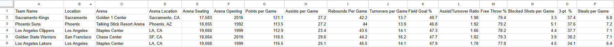
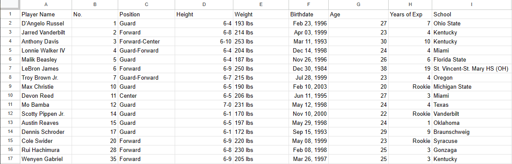

# Group5-NBA-Data
 Group project for CS 431

**Adrian Arriola**
```
Came up with idea to use a sports team for data
Input data for Lakers, and Teams from G2 through P6
```



**Adrian Delfin**
```
Found data for NBA players and teams
```

**Joshua Chung**
```
Created document page and organized columns
Added additional tables/columns for general managers and NBA divisions
```

**References:**

https://www.nba.com/teams (Team and Player Stats)

https://sports.yahoo.com/nba/teams/ (Team and Player Stats)

https://en.wikipedia.org/wiki/List_of_National_Basketball_Association_general_managers (Team GMs)
